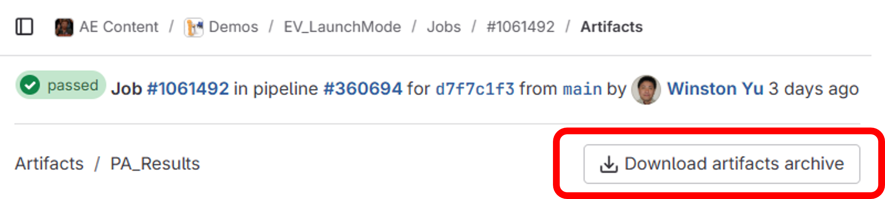
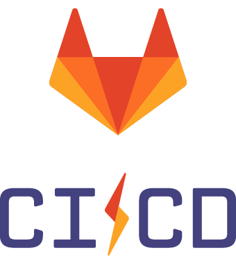
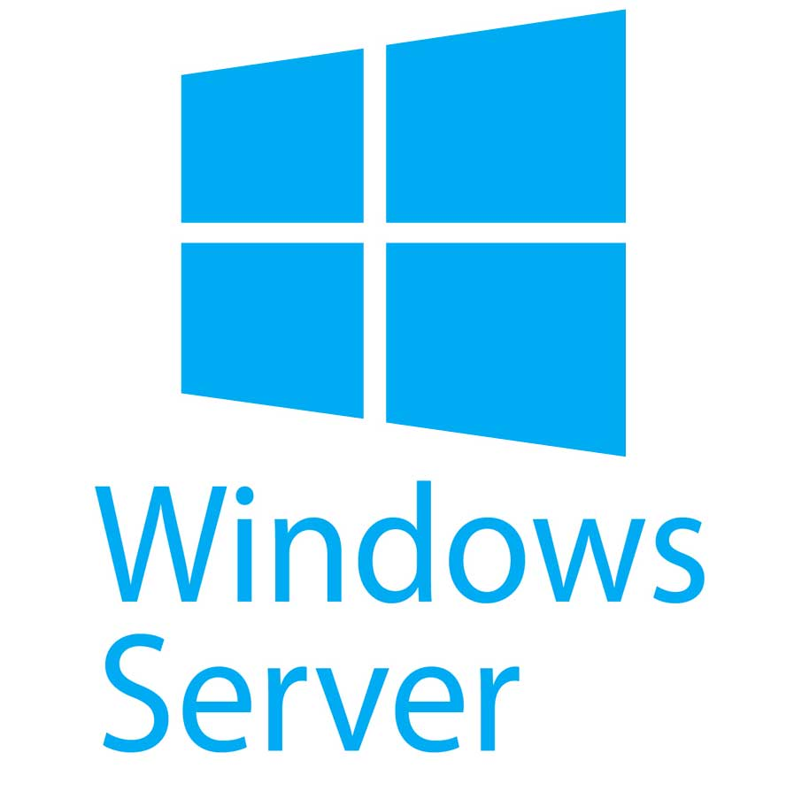
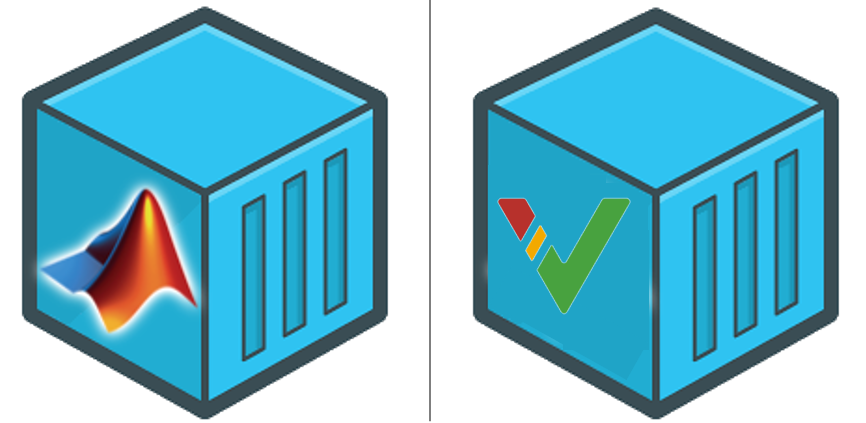
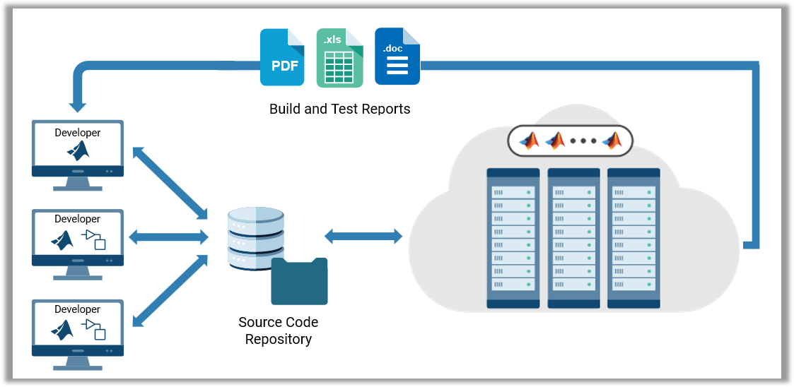
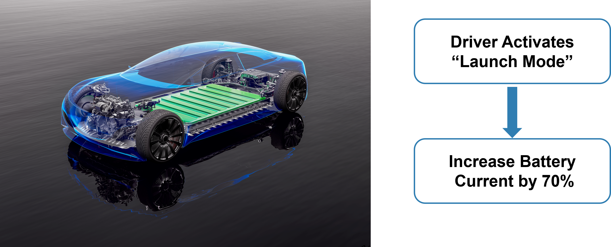
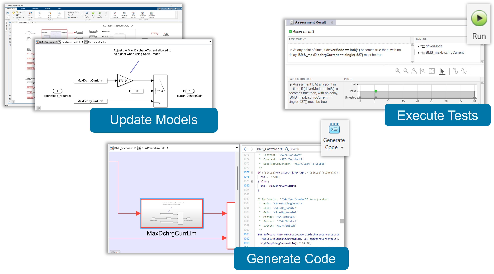
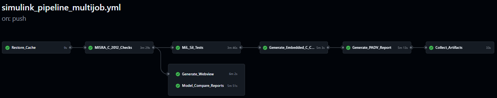
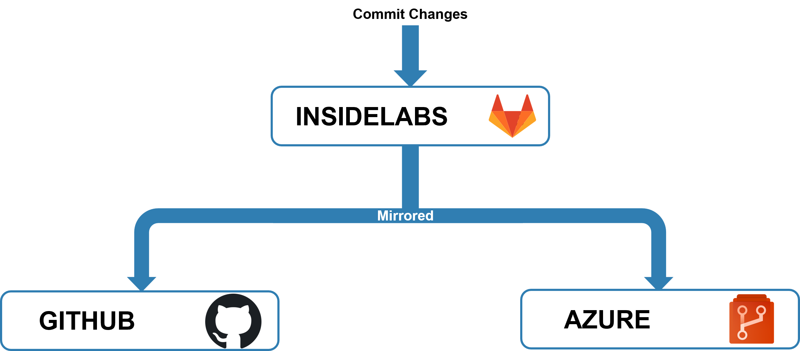

# Continuous Integration (CI) for MBD - Automate Model Testing and and Generate AUTOSAR Compliant Code
*Using automotive controllers as an example, let's learn how to effectively setup CI pipelines for Model-Based Design, and how it will benefit your team*
 

## Review Latest Artifacts
Download the Artifacts (Zip File) of the latest job. Click on the hyperlinks below to access the artifacts from the latest pipeline. 
| MISRA C Compliance Check | Model Compare Reports  (if any) | Model WebViews | Test & Coverage Results | Generated Code |
|--------------------------|--------------------------------|----------------|-------------------------|----------------|
| [Link](https://insidelabs-git.mathworks.com/AE-Content/demos/ev_launchmode/-/jobs/artifacts/main/browse/PA_Results/?job=Check_Modeling_Standards) | [Link](https://insidelabs-git.mathworks.com/AE-Content/demos/ev_launchmode/-/jobs/artifacts/main/browse/PA_Results/?job=Generate_Model_Comparison) | [Link](https://insidelabs-git.mathworks.com/AE-Content/demos/ev_launchmode/-/jobs/artifacts/main/browse/PA_Results/?job=Generate_Simulink_Web_View) | [Link](https://insidelabs-git.mathworks.com/AE-Content/demos/ev_launchmode/-/jobs/artifacts/main/browse/PA_Results/test_results/?job=Merge_Test_Results) | [Link](https://insidelabs-git.mathworks.com/AE-Content/demos/ev_launchmode/-/jobs/artifacts/main/browse/GeneratedArtifacts/CodeGen/?job=Zip_Up_Generated_Code_and_Details) |

You can then download the artifacts from the artifact webpage.
 
 

## CI/CD Pipelines: Current Status
| **[(InsideLabs) GitLab CI/CD](https://insidelabs-git.mathworks.com/AE-Content/demos/ev_launchmode)**  | **[GitHub Actions](https://github.com/smuckati1/EV_LaunchMode)**   | **[Azure DevOps](https://dev.azure.com/wyu0218/_git/EV_LaunchMode)**  |
|:--------------------------------------------------:|:--------------------------------------------------:|:--------------------------------------------------:|
|Natick Hosted Windows Server  |Microsoft Hosted Linux VMs  |Conatiner images hosted in Azure Registry  |
| || |

The repository runs CI/CD pipelines across multiple platforms, showcasing seamless MATLAB and Simulink integration with diverse CI systems. Learn more [here](https://www.mathworks.com/help/matlab/matlab_prog/continuous-integration-with-matlab-on-ci-platforms.html).
> **[Note]** Only clone the version from [InsideLabs](https://insidelabs-git.mathworks.com/AE-Content/demos/ev_launchmode). See instructions [below](#special-instructions).

  

## Why Continuous Integration?
- Frequent integration: Developers regularly merge code changes into a shared repository
- Automated testing: Each merge triggers an automated build and test process
- Early error detection: CI identifies issues early, keeping the codebase stable and release-ready

When multiple engineers are involved in making algorthms, we need to ensure the changes being made are coordinated and thoroughly tested. Automating this work saves you a lot of time while preserving the quality of your code. 

## Demo Overview
In this example, we assume we are a team working to release a new "Launch Mode" for their electric cars. 

Update the Battery Management System (BMS) to increase the Max Discharge Current by 70%.

### What the MBD developer would do? 

### What the automated pipeline will execute?

--

## Key Features Showcased in this Demo
1. MATLAB Projects enable you to manage your environment and use source control
2. Process Advisor makes it easy to setup your CI pipeline, leveraging prebuilt tasks and a template process definition
3. Process Advisor enables you to auto generate YAML files for popular CI platforms (such as GitHub Actions), making it easy to adopt CI
4. The matlab-batch token enables you to license and execute multple jobs simulatenaously on different environemtns.
5. MATLAB, Simulink and Polyspace can be containerized and executed on the automation environment of your choice.

## Relevant Apps/Workflows
- Use Continuous Integration (CI) to automate checks, tests and codeGen
- Executing CI workflows with containerized MATLAB as your runner
- Use of the CI/CD support package for Simulink (i.e. Process Advisor)
- Using Projects and Source Control to manage your files/folders
- MISRA C Checks using Simulink Check
- MiL Testing with Simulink Test
- AUTOSAR - Generate Classic AUTOSAR compliant C code for BMS
- AUTOSAR - Generate Adaptive AUTOSAR compliant CPP code for VCU

## Special Instructions
- **[InsideLabs](https://insidelabs-git.mathworks.com/AE-Content/demos/ev_launchmode) is the single source of truth.**  
  Only clone, edit, and commit changes to the InsideLabs GitLab repository.
- **Push changes to InsideLabs GitLab only.**  
  Once changes are pushed, they are automatically propagated to the other repositories via GitLab repository mirroring.
  - 
- **All CI/CD pipelines will then run automatically.**  
  A single push to InsideLabs GitLab triggers:
  - the InsideLabs GitLab CI/CD pipeline
  - the mirrored GitHub Actions pipelines
  - the mirrored Azure DevOps pipelines

## Relevant Products
Simulink, Stateflow, System Composer, Simulink Test, Embedded Coder, AUTOSAR Blockset, Simulink Check

## Recording
[MATLAB EXPO 2025 - CI for Simulink](https://www.mathworks.com/videos/ci-for-simulink-speed-up-model-based-design-with-automated-pipelines-1762247698554.html)

## Contact
Sameer K Muckatira, Jason Ghidella, Winston Yu, Sagar Hukkire

## Relevant Industries
* MBD adopter who are looking to use Continuous Integration, and starting on DevOps
* Automotive customers doing AUTOSAR compliant code generation looking for MiL and SiL
